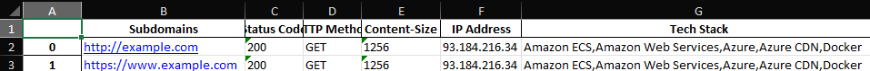

This tool simplifies the recon process for bugbounty and organizes all findings into an Excel Document. The idea behind this is to collect information for recon, and help with visualizing the data that is collected. 




# Install Instructions:

(all OS):
  ```
  python3 bin_installer.py
  pip install -r requirements.txt
  ```

**linux ONLY**" 
** This command MUST also be run for linux systems for the script to work**
  ```
  sudo chmod +x bin/*/*
  ```


# Usage:

*usage:* bountyforone.py -u/-l URL [-s] [-ls] [-ax] [-td] [-p] [-vs] [-sp] [-as] [-a]

**Bountyforone - Bug bounty tool**

```
options:
  -h, --help            show this help message and exit
  -u URL, --url URL     Enter the domain name for the target [e.g example.com]
  -l URL, --list URL    runs command(s) on a list of targets [specify a file path]
  -s, --subdomains      grab subdomains for a given domain
  -ls --live-subdomains verify the status of a domain or file of doamins
  -ax, --apex           Grab apex domains of a domain for file of domains
  -td, --tech-detection run technnology detection against a single url or list of domains
  -p, --port            basic port scan on url or list of domains
  -vs, --vulnscan       basic vuln scan on url or list of domains
  -sp, --spider         basic spider on url or list of domains
  -as, --asn            grab asn information for url or list of domains
  ```


example usage:
  **This example extracts technology stack and ports from the specified file**
  ```
  python3 bountyforone.py -l example.txt -td -p
  ```


